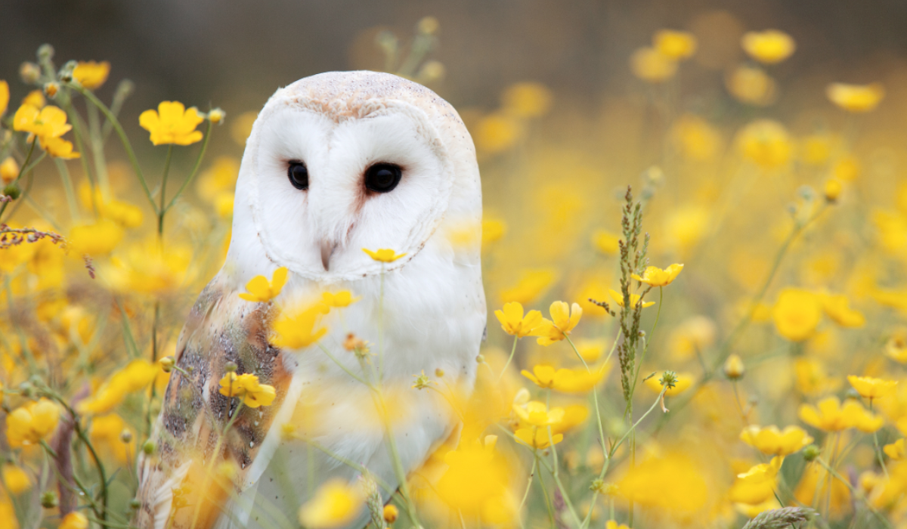

# `REAMDE.md` for [barn-owl](https://github.com/Ai-Yukino/barn-owl)

    

[🖼 Andy Chilton | Unsplash](https://unsplash.com/photos/zICEeDwWH0o)

---

Automated formant extraction in Praat purely from audio files, e.g. without creating `.TextGrid` files;

## ❄ References ❄

[📝 Automatic Formant Extraction in Praat](https://joeystanley.com/downloads/191002-formant_extraction)

- [Joey Stanley](https://joeystanley.com/) and [Lisa Lipani](https://www.linkedin.com/in/lisa-lipani/)

[🎥 Make your own vowel chart! | Listen Lab](https://www.youtube.com/watch?v=BGW8J4cG0qY)

- [🧑💻 ListenLab / make_vowel_space](https://github.com/ListenLab/make_vowel_space)

[🎥 Using Praat for high-quality speech manipulation & illustration: practices & demonstrations (M.Winn) | Listen Lab](https://www.youtube.com/watch?v=IOl8Q9EYcqk)

- [🧑💻 ListenLab / Praat](https://github.com/ListenLab/Praat)
